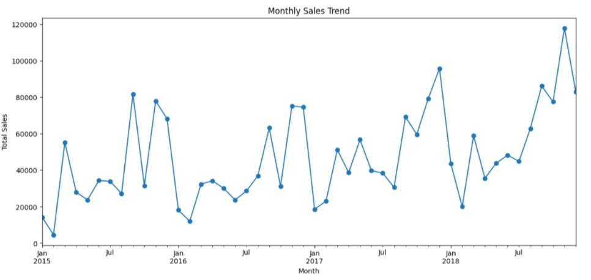
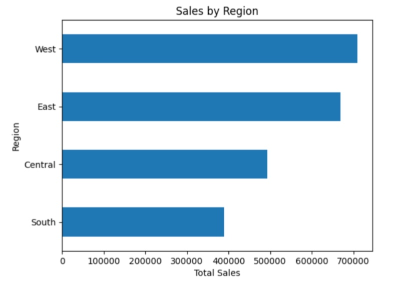

Full notebook available on Kaggle: [link](https://www.kaggle.com/code/ruonezhang/retail-sales-analysis-business-insights)

# Retail Sales Analysis & Business Insights

## Overview
This project analyzes a retail sales dataset to uncover key business patterns across time, geography, product categories, and customer segments.

The objective is to transform raw transactional data into actionable insights that support data-driven decision-making in sales strategy, product management, and operations.

---

## Objectives

- Analyze sales trends and identify seasonality patterns  
- Evaluate geographic performance and concentration  
- Understand product category and sub-category performance  
- Explore customer segmentation  
- Assess operational efficiency through order processing time  

---

## Dataset

- Retail transaction dataset (2015–2018)
- Includes order details, customer segments, product categories, and sales values

---

## Tools & Technologies

- Python  
- Pandas  
- Matplotlib  
- Seaborn  
- Jupyter Notebook  

---

## Key Insights

1. **Sales show growth and seasonality**  
   Sales exhibit a clear upward trend over time, with strong seasonal patterns. Demand peaks in November–December and shows additional strength around September.

2. **Regional performance is uneven but not highly concentrated**  
   Certain regions contribute more to total sales, but the distribution remains relatively balanced, indicating the presence of key markets without excessive dependency.

3. **Geographic concentration is moderate**  
   A small number of states and cities account for a meaningful share of revenue, but not to an extreme level, suggesting manageable concentration risk.

4. **Product performance is highly skewed toward Technology**  
   Technology is the leading category across all regions, with sub-categories such as Phones and Chairs contributing significantly more than others.

5. **Sales distribution follows a long-tail pattern**  
   A small number of sub-categories drive most of the revenue, while many others contribute relatively little.

6. **Product preferences vary across regions**  
   While Technology dominates overall, some regions exhibit a more balanced product mix, indicating differences in customer demand patterns.

7. **Consumer segment is the primary revenue driver**  
   The Consumer segment contributes the largest share of sales, forming the core customer base.

8. **Order processing is stable but not highly efficient**  
   Most orders are processed within 3–6 days, with a peak around 4 days. While extreme delays are rare, faster processing times are relatively uncommon.

---

## Recommendations

- **Leverage seasonal demand patterns**  
  Align inventory planning and promotional strategies with peak periods such as November–December and September.

- **Strengthen underperforming product categories**  
  Increase focus on Furniture and Office Supplies through targeted promotions and pricing strategies.

- **Reduce reliance on a narrow product base**  
  Diversify the product mix to mitigate risk from over-dependence on Technology-related products.

- **Adopt region-specific strategies**  
  Tailor product offerings and marketing efforts based on regional demand differences.

- **Improve operational efficiency**  
  Optimize order processing workflows to reduce fulfillment time and enhance customer experience.

---

## Project Structure

```
retail-sales-analysis/
├── notebook/
│   └── analysis.ipynb
├── images/
│   └── charts/
└── README.md
```


---

## Key Visualizations

-  
- 
- Geographic concentration (states & cities)  
- Product category and sub-category analysis  
- Region × Category comparison  
- Customer segment distribution  
- Order processing time distribution  

---

## Conclusion

This project demonstrates how retail transaction data can be transformed into meaningful business insights through structured analysis and visualization.

The findings highlight opportunities in product diversification, regional optimization, and operational improvement, providing a foundation for more effective business decision-making.

---

## Author

Ruone Z
